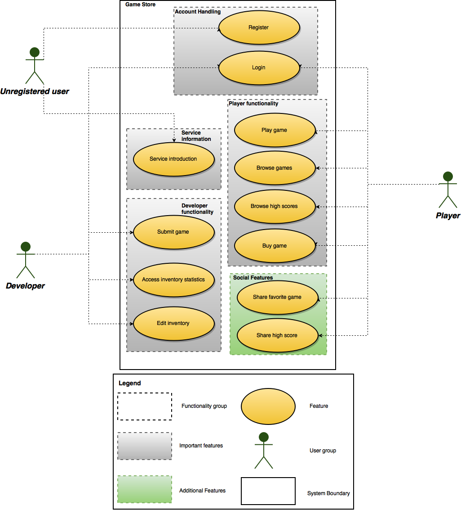
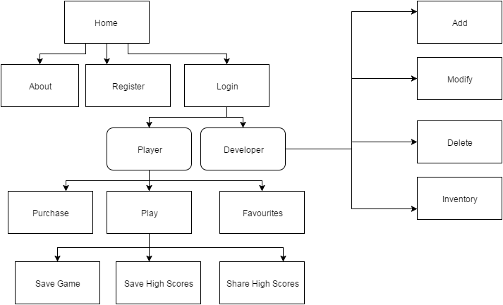
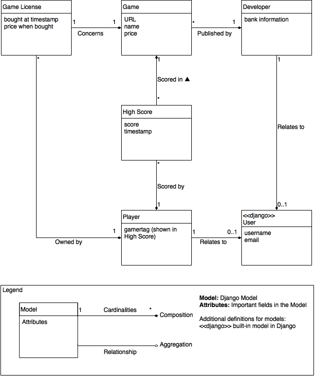

Ye Olde Game Shoppe - Project plan
==================================

# Members

Martin Yrjölä, 84086N

Lakshika Perera, 547411

Sai Manoj Katta Rokkaiah, 465111

# Use cases

* **Use Case 1:** The player views the game as unregistered user and then signs
  up. He purchases games,plays and saves at times to compare the highscores and
  compete with others.

* **Use Case 2:** The developer adds games, modifies according to the needs of
  the user on a timely schedule. He might delete it, in case, he feels like.

* **Use Case 3:** Neither player nor developer. Wants to see the games available
  and look at the high scores.

* **Use Case 4:** Genuinely, interested in buying all the games and playing all
  the time, who is a rich brat. Wants to show off all the high scores he did it
  in Social Media.

* **Use Case 5:** A nice person,who is playing for fun and entertainment who
  buys games occasionally.

* **Use Case 6:** A person who is representing a company and always looking for
  profits and making the games famous.

# User groups:

## Unregistered user:

This user group has a access to introductory information about what the service
is about from both the **Player’s** and **Developer’s** point of view. The user
can then register either a **Player** or **Developer** account.

**Personas:**

* Curious Kate
  * Needs a short distraction
  * Stumbles upon our service and wants to know what it’s all about
* Jake the fledgling game developer*
  * Dreams about getting rich on game development
  * Wants an easy way to publish his games for as big audience as possible

## Player

The **Player** user group has registered to the service and can browse and play
games. A **Player** will be able to compare his/her high scores with other users
and share his/her high scores or favorite games on social media.

**Personas:**

* Marco Casual
  * Wants to relax once in a while with quality entertainment
  * Doesn’t want too much of a challenge, but is seeking for easy fun
  * Doesn’t care about high scores
* Hardcore Tom
  * "Winning is everything"
  * Tom wants to be the best and beat all his friends and the rest of the world
  * He takes much pride in his high scores and likes to boast about them on
    social media

## Developer

**Developers** are the ones providing content to our service. They are able to
submit their games to the store. They can also access statistics related to
their games, so that they can analyze how well the game is faring.

**Personas:**

* Big Game Corp
  * Professional company with an ever increasing catalogue of games
  * Maximizing the bottom line is important
  * Very interested in analyzing statistics to further improve the profits
* Oleg one man show
  * A lone game developer doing games for fun and profit
  * Wants to have his games published in the simplest way possible

## Use case diagram

This diagram is aimed at getting a better big picture view of the service. It
lists the user groups and what features they are using.

# Site map

This gives the sitemap of the modules planned according to the specification
requirements.

# Django Views

Breakdown of functionalities

* Register

  * createAccount(): render NewAccount

* Login

  * loginLocalAccount() : render Login

  * thirdPartyLogin() : render Login => render UserHomePage

  *  showMyGames()

  * logout()

* Browse games

  * showAllGames() : render Games

* For each game:

  * Render GameFunctions, viewInfo()

    *  buy()

* My games:

  *  showMyGames() : render Games/userID

* For each game:

  * player persona: render GameFunctions

    * showGames(userID)

    * play()

    * shareGame()

    *  viewScores()

    * shareScores()

  * developer persona: render GameFunctions

    * showGames(userID)

    * delete()

    * modify()

    * viewStatistics()

    * shareGame()

* Add games:

  * addGame() : render NewGame

* Play games

  * play : render GameScreen play()

  * pause()

  * resume()

  * shareGame()

  * viewScores()

  * shareScores()

# Django Models

# Feature planning

## Authentication

* [-] Checklist

    * [ ] login

    * [ ] logout

    * [ ] register

    * [ ] security (what features need login?)

There is a description in the project for email validation. We will try to
implement third party login. If we succeed to implement the third party login,
it’ll be added as an extra feature along with the basic requirement. We will
start with that and if it fails we will use Django's user account control. The
basic login,logout and register modules will be done.

## Basic player functionalities

* [-] Checklist

    * [ ] Play games

    * [ ] Also consider how your players will find games

We need to consider the design very well on what we should focus more upon. At
this point, the dynamic functionality and content is important over user
interface. Because these features are the core building blocks of our service.
Luckily Martin and Manoj have done the Web Design course. So planning is
essential first and develop later based on it.

Implementing a search option as category would be nice. Also, we plan to
implement a feature that they would want to see the trend. It can be anything.
Most played games, cheapest ones, the one with best reviews offline or the ones
that their friends are playing.

## Basic developer functionalities

* [-] Checklist

    * [ ] Add a game (URL) and set price for that game and manage that game
      (remove, modify)

    * [ ] Basic game inventory and sales statistics (how many of the developers'
      games have been bought and when)

The plan is to make a very basic version of these features first as they are
very simple. Eye candy afterwards if we have time. By collecting time stamps for
the DateTimeValidation, a conclusion can be done on when the sales are high.
Also, by age or popularity, the sales statistics could be known.The inventory of
games will be displaying the values from the database which wouldn’t be a
problem. None in the team have much experience with Django, so these features
will serve as a nice tutorial.

## Game/service interaction

When player has finished playing a game (or presses submit score), the game
sends a postMessage to the parent window containing the current score. This
score must be recorded to the player's scores and to the global high score list
for that game. See section on Game Developer Information for details. Messages
from service to the game must be implemented as well.

This will probably be implemented last of the mandatory features, because it
needs some infrastructure in place. We could link a function that sends messages
on pre-defined conditions and at regular time intervals based on the progress of
the game/player or as the requirements set by the developer in general.

## Payment

Buy games, payment is handled by a mockup payment service:
[http://payments.webcourse.niksula.hut.fi/](http://payments.webcourse.niksula.hut.fi/)

## Documentation

We will start documenting the service at the end of January as things become
clearer and better. Making drafts,writing points will be done in parallel.
Number of hours worked will be taken into account.

## Testing

Simple tests in the beginning to provide the harness to build more tests when
needed. We won't be aiming for top notch testing in this project.

## Security

Security should always be considered when implementing the features, but
mistakes and blunders are always possible. Therefore we need to go through a
security checklist in the polishing phase of the project:

1. Should only developers get access to this feature/page?

2. Should only logged in users get access to this feature/page?

3. Are all form inputs validated?

  * Wouldn’t third party validate already, if implemented? Else, yes. We
    need to define rules for it.

4. What about the game URL:s? Is it possible for a developer to perform an
   attack with a malicious URL?

5. One player shouldn’t access the other player info. The access should be
   limited. Same in the case of developers.

6. Example registering to your service with simple html form via http and
   without any csrf_token makes your site vulnerable.

7. Developer and player should not cross each other. We need some kind of
   constraint to let a single user only be either Player or Developer.

## Optional Modules:

## 3rd party login

Should be considered when implementing the authentication.

## Social media sharing

Hopefully easy to accomplish. Can be implemented very late. But good if the
design considers the placement of the "share"-buttons.

## Mobile Friendly

Should be considered from the beginning. Maybe Bootstrap provides some
responsive design components?

## Save/load and resolution feature

The service supports saving and loading for games with the simple message
protocol described in Game Developer Information. Will get implemented when we
have the game running and the basic Game/Service interaction implemented.

## RESTful API

Considered a nice to have feature. We will implement it late in the project if
we have the time.

## Own game

We decided that we will implement [Pong](https://en.wikipedia.org/wiki/Pong) in
Javascript. We will implement it after the mandatory features are implemented.

# Tools and processes:

We chose to use Facebook as our communication medium as everyone was already a
Facebook user. Choosing other tools like Flowdock or Slack would take some time
to learn. We have also scheduled a Skype meeting and a whole day hackathon in
December. We will schedule more face to face meetings next year when needed.

For project management we use Trello as it is an easy to use and lightweight
task management solution. The drawback to this decision is that we initially
have the need to document this project plan as well, which results in duplicate
work. We tried to mitigate this issue by doing the initial planning in Trello
and extracting the data from there to the project plan. After polishing the
project plan we probably need to synchronize some documentation back to Trello
and keep Trello as our main place for documentation, scheduling and task
management to keep things simple.

The development process would be well supported by git hooks doing static code
analysis and other checks before allowing each push. It would be beneficial to
have these validation hooks running as early as possible, but we need to figure
out how to set them up first. Martin will try to achieve this shortly after the
project plan deadline. If it takes too much time, then we will need to
reconsider if the hooks are necessary for development. Examples of useful hooks
are:

* pep8

* jshint

* pyflakes

* HTML and CSS validation

* unit tests (unfortunately Travis-CI is only supported on Github)

# Timelines and important deadlines

* Week 0 (Until December 20th):

  * Meeting regarding discussion of project,plans and basic idea.

  * Project Report

* Week 1 (December 21-27):

  * Authentication Module

* Week 2 (28-3):

  * Basic player functionalities

  * Basic developer functionalities

* Week 3 (4-10) :

  * Game/service interaction

* Week 4(11-17):Additional modules

  * 3rd party login

  * Social media sharing

* Week 5(18-24):

  * Documentation.

* Week 6 (25-31):Additional modules.

  * Save/load and resolution feature

  * Own game

  * Mobile Friendly

* Week 7 (1-7): Wrapping up and Finalization. Taking appointment.

* Week 8(8-14):Presentation and submission of document.
